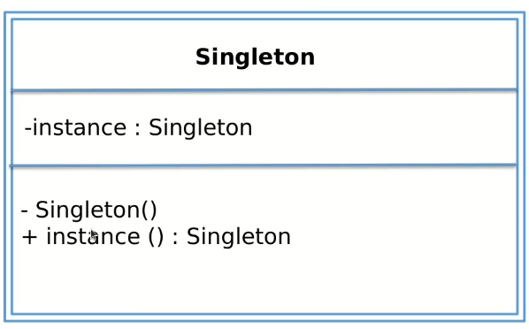

# Singleton
Utilizado quando você quer que exista apenas um objeto desse tipo no software

## Onde utilizar
1. Log
2. Operações de bancos de dados
3. Filas de impressão

## Para quê serve
Evitar operações conflitantes.

